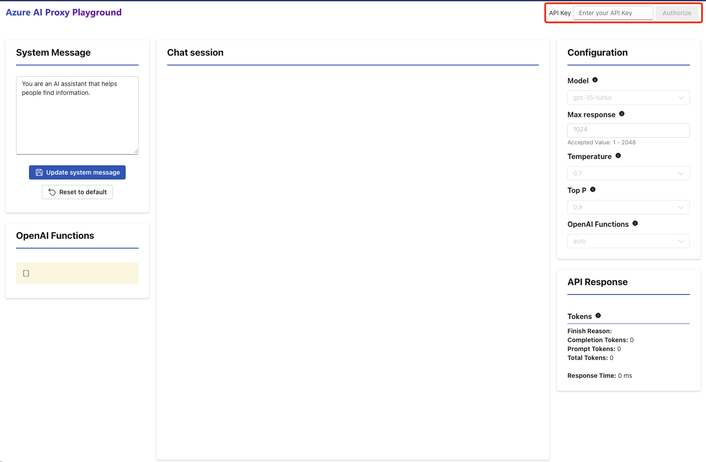
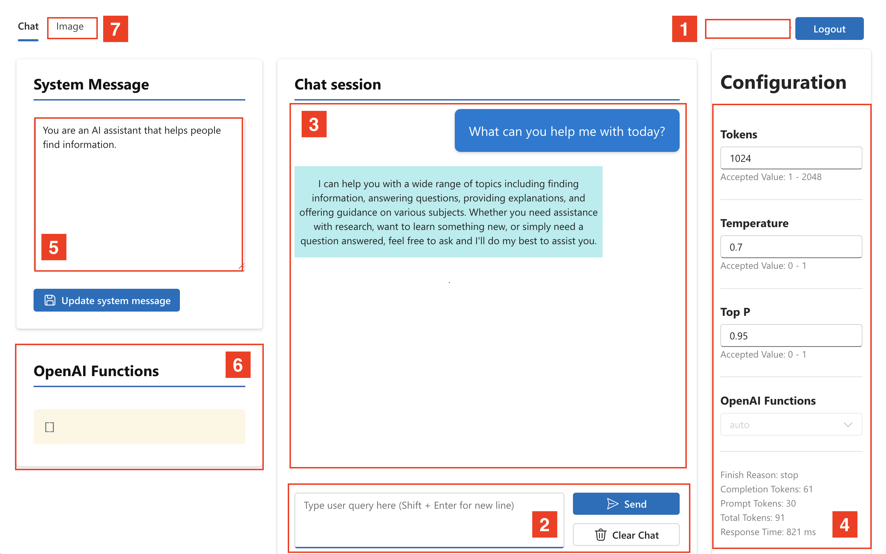

:::info WORKSHOP PRE-REQUISITES

- **自分のノートパソコンを使用する**.  
- **最新のブラウザを起動する**. (最良の体験のためにedgeまたはchromeを使用)  
   
:::このワークショップでは、Azure OpenAI Serviceの上に構築されたカスタムプレイグラウンドを使用します。このプレイグラウンドでは、プロンプトを操作し、OpenAIモデルとどのように対話するかを学ぶ機会があります。  
   
## 認証  
   
登録したAI Proxy APIキーを使用します。  
   
1. AI Proxy Playgroundに移動します。このリンクはこのワークショップに登録したときに見つけることができます。  
2. 右上に**APIキー**を入力し、`Authorize`をクリックしてログインします。
   

## 探索  
   
ログインに成功すると、プレイグラウンドアプリケーションが更新され、右上に`Logout`ボタンが表示されるはずです。設定を確認するために、ユーザープロンプト入力ボックス（地域2）にクエリを入力し、`Send`をクリックします。以下のようにチャットセッションエリア（地域3）で会話の応答を得ることができます。  
   
このアプリのさまざまな地域に慣れるために、少し時間を取りましょう。



- 地域 1️⃣ | 承認されると、イベントプロファイルが表示されます。  
- 地域 2️⃣ | ユーザープロンプト - AIへのテキスト質問を入力するために使用  
- 地域 3️⃣ | 会話 - ユーザーの質問とアシスタントの応答が交互に表示されます  
- 地域 4️⃣ | 設定 - 調整可能なパラメーター、実行統計  
- 地域 5️⃣ | システムメッセージ - アシスタントのペルソナ、基本コンテキストを設定  
- 地域 6️⃣ | 関数呼び出し - コンテキストを設定するためのカスタム関数を保存  
- 地域 7️⃣ | 画像生成 - DALL-Eモデルプレイグラウンドへのアクセス  
   
## ヒント  
   
### 1. モデルを選択する  
   
プレイグラウンドは複数のモデルをサポートしています。モデルと対話する前に、**Configuration**セクションの**Model**ドロップダウンからモデルを選択する必要があります。  
   
### 2. チャットセッションをクリアする  
   
モデルの出力はチャットセッションの内容に影響されます。モデルの出力が以前のプロンプトに影響されないようにするために、新しいプロンプトを入力する前に「Clear Chat」ボタンをクリックしてください。  
   
### 3. スニペットをコピー＆ペーストする  
   
プロンプトベースの演習では、次のように_コードフェンス_されたスニペットでプロンプト入力が提供されます。ブラウザでこのページを表示しているときに、以下のコードフェンス領域内を_クリック_すると、右側に`copy`アイコンが表示されます。それをクリックしてプロンプトをクリップボードにコピーし、<kbd>Ctrl-V</kbd>（または同等の）コマンドを使用してプレイグラウンドのテキスト入力領域にペーストします。  
   
```text  
これはチャットプロンプト入力フィールドに入力する必要があるプロンプトテキストです。
```