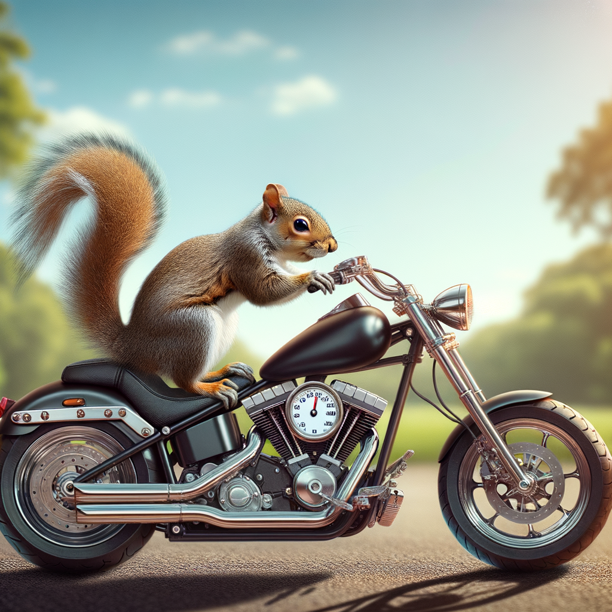
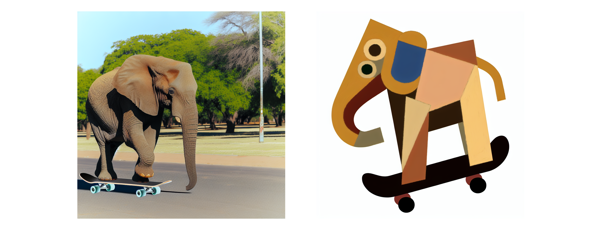

# 画像生成


:::tip DALL-Eとは何ですか？DALL-Eは自然言語の入力からグラフィカルデータを生成できるニューラルネットワークベースのモデルです。もっと簡単に言えば、DALL-Eに説明を提供すると、それに適した画像を生成することができます。:::  
   
Azure OpenAIサービスにはDALL-Eモデルが含まれており、自然言語のプロンプトに基づいてオリジナルの画像を生成するために使用できます。  
   
例えば、次のような自然言語のプロンプトをDALL-Eに提出することができます。  
   
```text title="ユーザーメッセージ"  
オートバイに乗ったリス  
```  
   
このプロンプトは次のような画像の生成をもたらす可能性があります。



DALL-Eが生成する画像はオリジナルであり、キュレーションされた画像カタログから取得されるものではありません。つまり、DALL-Eは適切な画像を見つけるための検索システムではなく、学習したデータに基づいて新しい画像を生成する人工知能（AI）モデルです。  
   
## 詳細に記述する  
   
プロンプトボックスに、生成したい画像の説明を入力します。例えば:  
   
```text title="ユーザーメッセージ"  
スケートボードに乗った象  
```  
   
次に「生成」を選択し、生成された画像を表示します。  
   
プロンプトを変更して、より具体的な説明を提供します。例えば:  
   
```text  
ピカソ風のスケートボードに乗った象  
```  
   
次に、新しい画像を生成し、結果を確認します。




## ベストプラクティス  
   
DALL-Eで効果的かつ正確な画像を作成するためのベストプラクティスを以下に示します:  
   
1. **明確で詳細なプロンプト**: テキストプロンプトを明確かつ詳細に作成します。説明が具体的であるほど、DALL-Eはあなたの要求に合った画像を生成しやすくなります。対象、動作、環境、スタイル、および重要な詳細などの属性を含めます。  
   
2. **形容詞の使用**: 形容詞や副詞を使用して、画像に伝えたい特質、感情、特徴を説明します。これにより、生成される画像があなたのビジョンにより近づきます。  
   
3. **詳細とシンプルさのバランス**: 詳細は重要ですが、過度に複雑または矛盾したプロンプトはAIを混乱させ、予期しない結果を招くことがあります。説明が過度に込み入らずに十分なコンテキストを提供するバランスを目指します。  
   
4. **さまざまなスタイルを試す**: 特定の美的感覚を持たせたい場合は、芸術スタイルや影響を指定します。例えば、ゴッホ風や未来的なコンセプトアートのスタイルを求めることができます。  
   
5. **反復的アプローチ**: 最初に生成される画像が完璧でないことがよくあります。生成された画像を出発点として、出力に基づいてプロンプトを反復的に改良し、望む結果に近づけます。  
   
6. **アスペクト比と構図**: 画像の構図やアスペクト比に好みがある場合は、プロンプトに含めます。例えば、風景志向の画像や、中心からずれた被写体を持つポートレートを要求することができます。  
   
7. **文化的および文脈的な参照**: 適切であれば、文化的または歴史的な参照を含めて、画像生成プロセスを導くための追加のコンテキストを提供します。  
   
8. **倫理的考慮事項**: プロンプトの倫理的な影響に注意を払いましょう。攻撃的な画像、ステレオタイプを助長する画像、または著作権を侵害する画像の作成を避けます。  
   
9. **テストと学習**: さまざまなプロンプトを試して、DALL-Eがさまざまな説明をどのように解釈するかを理解します。この学習プロセスにより、時間とともにプロンプトの精度を向上させることができます。  
   
10. **ガイドラインの遵守**: プロンプトを作成する際に、OpenAIの使用事例ポリシーおよびコンテンツガイドラインに従います。OpenAIのコンテンツポリシーにより許可されていない画像の要求を避けます。  
   
AI画像生成はまだ進化中の技術であり、望む結果を得るためには試行錯誤が必要な場合があります。これらのベストプラクティスに従うことで、DALL-Eで高品質な画像を作成する可能性を高めることができます。  
   
:::tip [課題]  
画像を作成するのを楽しみ、異なるスタイルで画像を作成してみてください。  
**Dall-E APIはプロンプトを修正することに注意してください**:::  
   
## 試してみると面白いこと  
- 新しい漫画キャラクターを作成する  
- クールな家具をデザインする  
- 新しい車やその他の乗り物を想像する  
- 完全に新しい惑星を作成する  
- 手紙を書かせてみる  
- 有名なランドマークのヴィンテージスタイルのカードを作成してみる