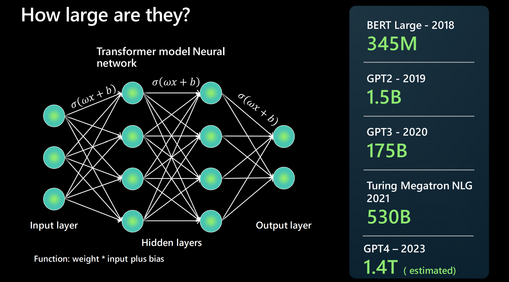

大規模言語モデル（LLM）は、自然言語のテキストを処理し生成することができるAIの一種です。書籍、記事、ウェブページなどの大量のテキストデータから学び、それらから言語のパターンやルールを発見します。  
   
### 大規模言語モデルの規模はどれくらい？

大規模言語モデル（LLM）は**ニューラルネットワークアーキテクチャ**を使用して構築されています。入力を受け取り、言語のさまざまな側面を分解する複数の隠れ層を持ち、そして出力層があります。次の基盤モデルが前のモデルよりも大きいとよく報告されますが、これは何を意味するのでしょうか？モデルにパラメータが多いほど、多くのデータを処理し、学習し、生成することができます。ニューラルネットワークアーキテクチャの2つのニューロン間の接続ごとに、_重み * 入力 + バイアス_ という関数があります。これらは数値を生成し、モデルが言語を処理する方法を決定します。これらは非常に大きく、2018年には数百万のパラメータが報告され、2023年には（GPT-4によって）数兆のパラメータが計算されました。  
   
### 基盤モデルとは？  
   
基盤モデルとは、GPT-3、GPT-4、Codexなどの特定のインスタンスやバージョンのLLMを指します。これらは大規模なテキストやコード（Codexモデルの場合）コーパスで訓練され、微調整されています。さまざまな形式のトレーニングデータを取り込み、**トランスフォーマーアーキテクチャ**を使用して一般的なモデルを構築します。そこから、プロンプトや微調整を通じて特定のタスクを達成するための適応や専門化が行われます。  
   
### LLMはNLPとどう違うのか？  
   
大規模言語モデルは従来の自然言語処理（NLP）ソリューションとどう違うのでしょうか？以下の表は比較のためのいくつかの指標を提供します。  
   
| 従来のNLP | 大規模言語モデル |  
| --- | --- |  
| 能力ごとに1つのモデルが必要 | 多くのNLPユースケースに単一のモデルを再利用 |  
| 有限のラベル付きデータセットで訓練されたモデル | 多くのTBのラベルなしデータで訓練された基盤モデル |  
| 特定のユースケースに高度に最適化 | オープンエンドの使用 - 自然言語を使用してモデルに何かをさせるプロンプトを使用 |  
   
### LLMがしないことは？  
   
大規模言語モデルが豊かで強力な生成AI体験を提供する一方で、LLMがしないことを覚えておくことが重要です：  
   
- **言語を理解しません。** これは単なる予測エンジンです。以前に見たテキストパターンに基づいて、与えられたテキスト入力の完了を予測することができます。内容の文脈や意味を理解しているわけではありません。例えば、数学を理解していません。  
- **事実を理解しません。** _情報検索_と_創造的執筆_のための別々の「モード」はありません。モデルは進行中のシーケンスで次に最も確率の高いトークンを予測するだけです。  
- **礼儀、感情、倫理を理解しません。** LLMに人間の特性を付与したり、「何かを理解している」と主張したりして_人間化_しないでください。出力は単に与えられたプロンプトに従ったトレーニングデータの結果です。