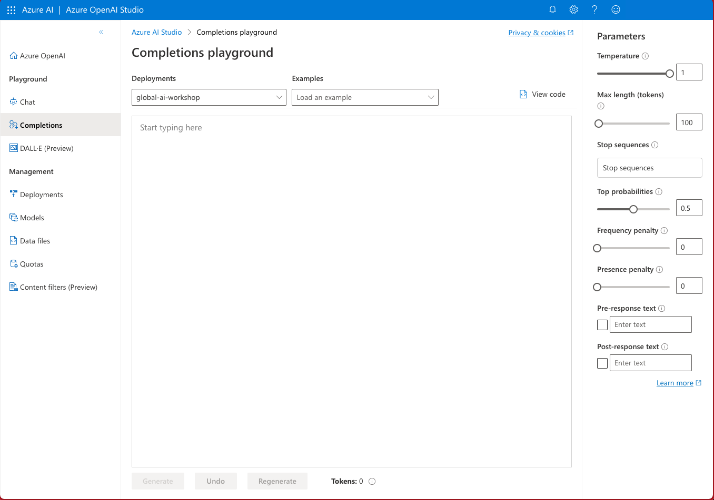

---
title: 自宅で
slug: /at-home
---  
## 自宅で  
   
:::warning 追加のセットアップが必要  
このワークショップは、自宅で自己指導のセッションとして完了することができます。ただし、記載された追加のセットアップ作業と依存関係が必要です。  
:::  
   
自己指導型のワークショップには、以下のものが必要です：  
   
- [ ] Azure サブスクリプション → [無料アカウントに申し込む](https://aka.ms/azure/free)  
- [ ] Azure OpenAI へのアクセス → [必要な場合はこちらから申し込む](https://learn.microsoft.com/azure/ai-services/openai/overview#how-do-i-get-access-to-azure-openai)  
- [ ] Azure Open AI リソース → [Azure OpenAI Studio を使用して作成](https://learn.microsoft.com/azure/ai-services/openai/how-to/create-resource?pivots=web-portal)  
- [ ] `gpt-3.5-turbo` モデルのデプロイメント → [Azure OpenAI Studio を使用してデプロイ](https://learn.microsoft.com/azure/ai-services/openai/how-to/create-resource?pivots=web-portal#deploy-a-model)  
   
その後、[Azure OpenAI Studio に移動](https://oai.azure.com/)して、コード不要の実験体験のための演習を完了できます。  
   
| Azure OpenAI Studio: プレイグラウンドアプリ |  

|:---:|
|  |

:::info OpenAI プレイグラウンドアプリ  
OpenAI プラットフォームには独自の[プレイグラウンドアプリケーション](https://platform.openai.com/playground)があり、有効な OpenAI アカウントでログインするとこれらの演習もそこで動作します。ご自身でこれを探索することをお勧めしますが、ワークショップのドキュメントでは Azure OpenAI の使用に焦点を当てます。  
:::  
